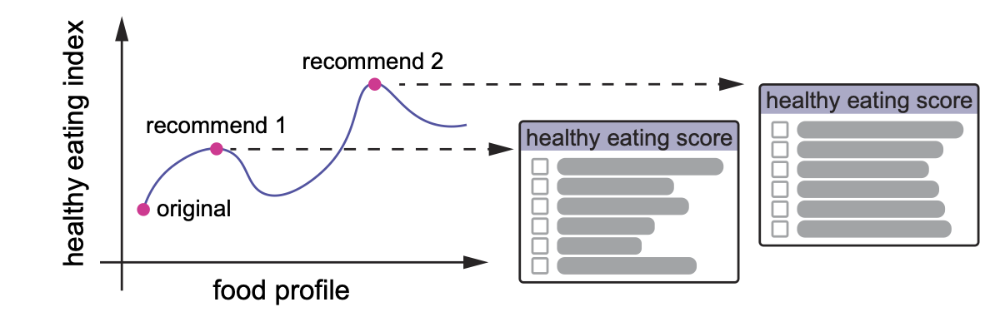

# ODR (optimization-based dietary recommendation)
This is a R implementation of ODR, as described in our paper:

Wang, X.W., Weiss, S.T. Hu, F. B, and Liu, Y.Y. [Optimization-based dietary recommendations for healthy eating]. 

  

## Contents
- [Overview](#overview)
- [Environment](#environment)
- [Installation](#installation)
- [How the use the ODR framework](#How-the-use-the-ODR-framework)
- [Additional information](#addition)
  
# Overview
Various diet scores have been developed to assess compliance with dietary guidelines. Yet, enhancing those diet scores is very challenging. Here, we tackle this issue by formalizing an optimization problem and solving it with simulated annealing. Our optimization-based dietary recommendation (ODR) approach, evaluated using Diet-Microbiome Association study data, provides efficient and reasonable recommendations for different diet scores. ODR has the potential to enhance nutritional counseling and promote dietary adherence for healthy eating.

# Environment
We have tested this code for R 4.3.1.

# Installation
<pre>
install.packages("remotes")
remotes::install_github("yourusername/simannealdiet")
</pre>

# How to use the ODR framework
**Prepare the Input Data:** The key step in running the ODR is formatting the input data to be compatible with the R package dietaryindex (see GitHub: https://github.com/jamesjiadazhan/dietaryindex). The required input should include both:

(1) Food Pattern Equivalents for individual foods

(2) Total Nutrient Intakes (for HEI-2015 calculation) derived from ASA24

**Optimization Example:**  

<pre>
data(demo_asa24_simulated) # Note that this is a toy dataset.  

result <- simulated_annealing_combined(demo_asa24_simulated, candidate = 1, niter = 20, diet_score = "HEI2015")  

Original and recommended diet is: "result$meal". The diet score during iteration is: "result$iterated_score".
</pre>
**Custom Diet Scores:** Users can optimize other diet scores by supplying their own dietary data and modifying the scoring function within the dietaryindex package accordingly.

# Additional information
During the optimization process, we randomly perturbed the existing diet, for example, by replacing a current food item with a randomly selected one. Candidate foods were randomly drawn from the full dataset. Information for each candidate food spans columns 16 to 129, including variables such as FoodNum, FoodType, nutrient profiles, and Food Pattern Equivalents.

Note: This structure should be adjusted if the food information in a custom dataset does not align with this column format.
