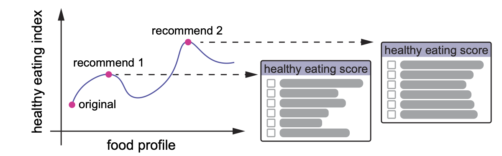

# ODR (optimization-based dietary recommendation)
This is a R implementation of ODR, as described in our paper:

Wang, X.W., Weiss, S.T. Hu, F. B, and Liu, Y.Y. [Optimization-based dietary recommendations for healthy eating]. 

  

## Contents
- [Overview](#overview)
- [Environment](#environment)
- [Repo Contents](#repo-contents)
- [How the use the ODR framework](#How-the-use-the-ODR-framework)

# Overview

Various diet scores have been developed to assess compliance with dietary guidelines. Yet, enhancing those diet scores is very challenging. Here, we tackle this issue by formalizing an optimization problem and solving it with simulated annealing. Our optimization-based dietary recommendation (ODR) approach, evaluated using Diet-Microbiome Association study data, provides efficient and reasonable recommendations for different diet scores. ODR has the potential to enhance nutritional counseling and promote dietary adherence for healthy eating.

# Environment
We have tested this code for R 4.3.1.

# Repo Contents
(1) A small demo dataset to test the ODR framework.

(2) R code to optimize the diet to improve the healthy eating score (HEI2015 as an example).

# Data type for ODR
## (1) p.csv: matrix of taxanomic profile of size N*M, where N is the number of taxa and M is the sample size (without header).

|           | sample 1 | sample 2 | sample 3 | sample 4 |
|-----------|----------|----------|----------|----------|
| species 1 | 0.45     | 0.35     | 0.86     | 0.77     |
| species 2 | 0.51     | 0        | 0        | 0        |
| species 3 | 0        | 0.25     | 0        | 0        |
| species 4 | 0        | 0        | 0.07     | 0        |
| species 5 | 0        | 0        | 0        | 0.17     |
| species 6 | 0.04     | 0.4      | 0.07     | 0.06     |

## (2) z.csv: pre-intervention species assemblage of size N*M, where N is the number of taxa and M is the sample size (without header).

|           | sample 1 | sample 2 | sample 3 | sample 4 | sample 5 | sample 6 | sample 7 | sample 8 | sample 9 | sample 10 | sample 11 | sample 12 |
|-----------|----------|----------|----------|----------|----------|----------|----------|----------|----------|-----------|-----------|-----------|
| species 1 | 0        | 1        | 1        | 0        | 1        | 1        | 0        | 1        | 1        | 0         | 1         | 1         |
| species 2 | 1        | 0        | 1        | 0        | 0        | 0        | 0        | 0        | 0        | 0         | 0         | 0         |
| species 3 | 0        | 0        | 0        | 1        | 0        | 1        | 0        | 0        | 0        | 0         | 0         | 0         |
| species 4 | 0        | 0        | 0        | 0        | 0        | 0        | 1        | 0        | 1        | 0         | 0         | 0         |
| species 5 | 0        | 0        | 0        | 0        | 0        | 0        | 0        | 0        | 0        | 1         | 0         | 1         |
| species 6 | 1        | 1        | 0        | 1        | 1        | 0        | 1        | 1        | 0        | 1         | 1         | 0         |

## (3) q.csv: dietary profile of size N*M, where S is the number of nutrient/food and M is the sample size (without header).

|           | sample 1 | sample 2 | sample 3 | sample 4 |
|-----------|----------|----------|----------|----------|
| nutrient 1 | 0.019     | 0.018     | 0.012     | 0.018     |
| nutrient 2 | 0.03     | 0.026        | 0.025        | 0.025        |
| nutrient 3 | 0.00085        | 0     | 0        | 0.0005        |
| nutrient 4 | 0.015        | 0.014        | 0.01     | 0.012        |
| nutrient 5 | 0.0019        | 0.0008        | 0.0007        | 0.0008     |
| nutrient 6 | 0.0006     | 0      | 0     | 0.003     |

# How to use the ODR framework
Run Python code in "code" folder: "DPDR_mapping.py" by taking p.csv, z.csv and q.csv as input will output the predicted microbiome composition.
Example: python DPDR_mapping.py --perturbation $perturbation --'sparsity' $sp --'connectivity' $C --noise $ep --ratio $ratio --fold $fold

